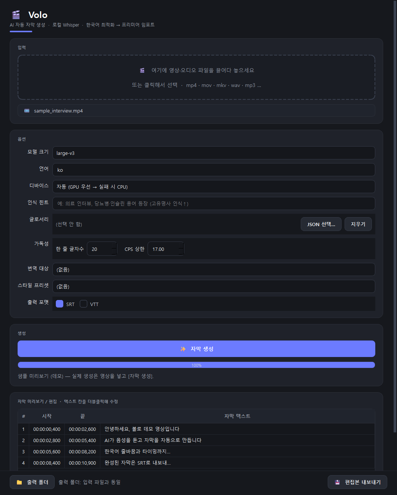
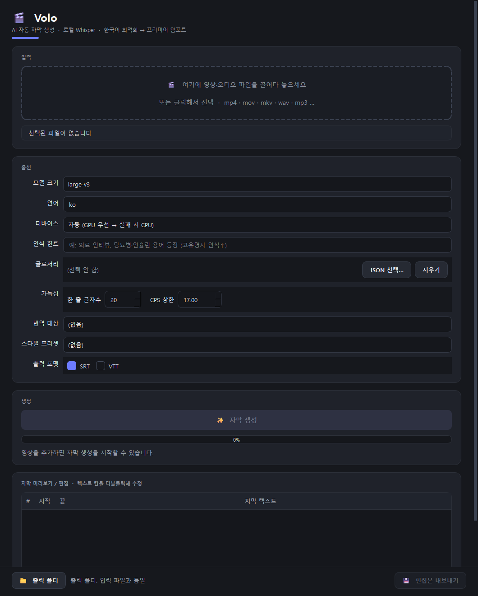
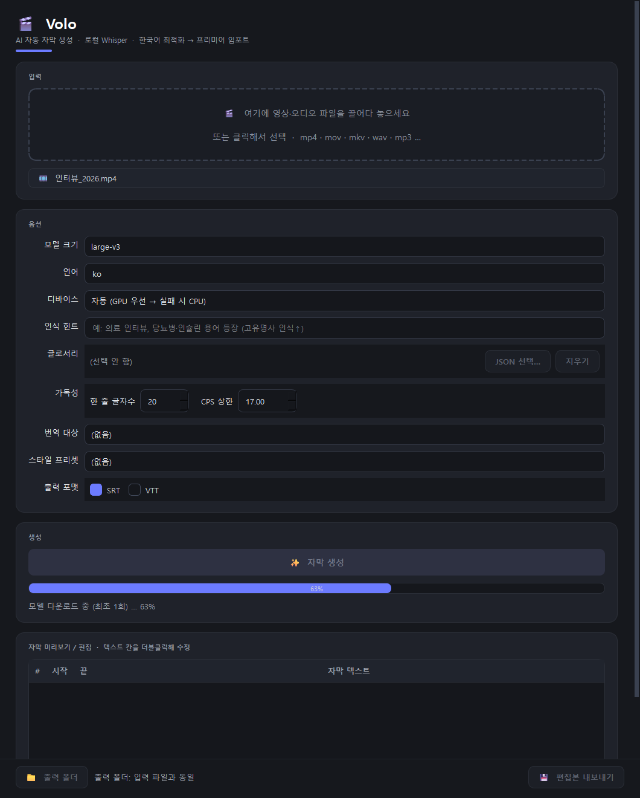

<div align="center">

# 🎬 Volo

**프리미어 프로용 AI 자동 자막 생성 데스크톱 툴**
_Voice + Log_

로컬 **faster-whisper**로 영상의 음성을 받아쓰고, 한국어 가독성에 맞춰 자막을 다듬어
**SRT/VTT 파일**로 내보냅니다. 영상을 외부로 업로드하지 않고(오프라인 가능, API 비용 0)
만든 자막을 **프리미어 프로 캡션 트랙으로 그대로 임포트**하세요.

[](LICENSE)


</div>



---

## 한눈에 보기

```
[영상] → 오디오 추출(ffmpeg) → STT 전사(faster-whisper) → 한국어 교정·글로서리
       → 줄바꿈·타이밍 최적화(CPS) → (번역) → (스타일) → SRT/VTT → 프리미어 임포트
```

자막을 한 줄 한 줄 손으로 치고 타이밍 맞추던 작업을, **영상 하나 넣으면 타임코드까지
맞춰진 자막 파일**로 끝냅니다.

### 주요 기능
- **로컬·무비용 STT** — faster-whisper 로컬 추론. GPU(CUDA) 자동 감지 → 없으면 CPU(int8) 폴백. **API 비용 0, 영상 외부 전송 없음.**
- **한국어 정확도 + 교정** — `large-v3` 기본 + 단어 단위 타임스탬프. 글로서리(고유명사·브랜드명)로 오인식 강제 교정.
- **줄바꿈·타이밍 최적화** — 초당 글자수(CPS)·한 줄 글자수·표시시간을 기준으로 자동 분할/병합. "편집자가 손볼 일"을 줄입니다.
- **번역/다국어** — 자막을 영어 등으로 번역해 언어별 SRT 동시 출력(번역 백엔드 연결 시).
- **스타일 프리셋** — 폰트/색/위치 프리셋을 사이드카(`*.style.json`)로 출력 → 프리미어 캡션 트랙에 적용.
- **표준 산출물** — `.srt` / `.vtt`. 기존 워크플로를 깨지 않고 그대로 임포트.

자세한 제품 정의는 [`docs/PRD.md`](docs/PRD.md), 기술 설계는 [`docs/ARCHITECTURE.md`](docs/ARCHITECTURE.md).

---

## ⚠️ 지금 누가 바로 쓸 수 있나요?

| 사용자 | 상태 | 방법 |
|---|---|---|
| **개발자 / 파워유저** | ✅ 바로 사용 | 소스 클론 → `pip install` → CLI/GUI 실행 ([B. 개발자 설치](#b-개발자--파워유저-소스에서-실행)) |
| **영상만 있는 일반 편집자** | 🟢 Releases 게시 후 더블클릭 | `.exe` 빌드·실행 검증 완료, CI 자동배포 준비됨. GitHub 게시 후 [Releases](../../releases)에서 zip 받아 실행 ([A](#a-일반-편집자-배포본--releases-에서-받기)) |

> **현재 상태:** 엔진·CLI·데스크톱 GUI + 테스트(62개 통과)가 준비됐고, **Windows `.exe` 빌드도
> 검증 완료**(GUI 실행·ffmpeg 동봉 확인)입니다. 태그 푸시 시 [CI](.github/workflows/release.yml)가
> 깨끗한 러너에서 빌드해 Releases 에 zip 을 자동 첨부합니다. 남은 건 **이 프로젝트를 GitHub 에
> 올리고(`git init`/push) 첫 버전 태그를 푸시**하는 것뿐입니다 → [RELEASING.md](RELEASING.md).

---

## 빠른 시작

### A. 일반 편집자 (배포본 — Releases 에서 받기)

> 파이썬 설치 없이 바로 씁니다. Windows 기준. (Releases 게시 후 사용 가능 — [릴리스 게시 절차](RELEASING.md))

1. **[Releases](../../releases)에서 다운로드** (원하는 버전 `vX.Y.Z`의 "Assets" — 둘 중 하나):
   - **`Volo-<버전>-windows.exe`** — **파일 1개**만 받아서 더블클릭(가장 간단). 첫 실행은 임시 추출로 다소 느릴 수 있습니다.
   - **`Volo-<버전>-windows.zip`** — 압축 해제 후 폴더 안 `Volo.exe` 실행(기동 빠름·백신 오탐 적음).
   - ("Source code (zip/tar.gz)"는 GitHub 자동 소스 묶음 — 개발자용이며 실행파일이 아닙니다.)
2. **실행** — SmartScreen("Windows의 PC 보호") 경고가 뜨면 **추가 정보 → 실행**(서명 안 된 배포본이라 처음 한 번).
3. 영상 파일을 창에 **드래그앤드롭**.
4. 옵션(모델 크기·언어·포맷) 확인 후 **[자막 생성]**.
5. **(최초 1회) 모델 자동 다운로드** — "모델 다운로드 중 (최초 1회) … N%". `large-v3` 약 3GB / `medium` 약 1.5GB 라 **인터넷·시간 필요**하고, 멈춘 듯 보여도 받는 중입니다. 한 번 받으면 캐시되어 다음부터는 빠르고 **오프라인** 동작.
6. 진행률 대기 → 자막 미리보기(표에서 더블클릭해 수정).
7. **[편집본 내보내기]** → `.srt` 저장 → [프리미어로 가져오기](#-프리미어-프로로-자막-가져오기).

ffmpeg 는 동봉/자동 폴백이라 따로 설치할 필요가 없습니다. 빠른 확인엔 모델 `medium` + 짧은 영상(1~2분)을 권장합니다.

### B. 개발자 / 파워유저 (소스에서 실행)

```bash
# 1) 클론
git clone <REPO_URL> Volo
cd Volo

# 2) 파이썬 3.11+ 가상환경
python -m venv .venv
# Windows
.venv\Scripts\activate
# macOS / Linux
source .venv/bin/activate

# 3) 설치 (엔진 + CLI + 데스크톱 UI + 개발도구)
pip install -e ".[app,dev]"

# 4) 실행 — CLI
volo "내영상.mp4" -o ./out --lang ko

# 4') 실행 — 데스크톱 GUI
volo-app          # 또는: python -m volo_app
```

> **Windows 사용자 주의 — `python`이 "Microsoft Store" 안내만 뜨고 안 될 때:**
> 윈도우의 PATH `python`/`py`가 실행되지 않는 **앱 별칭(스텁)**일 수 있습니다. 이때는
> 실제 파이썬(예: miniconda)의 절대경로로 실행하세요:
> `C:\Users\<you>\miniconda3\python.exe -m venv .venv` 처럼. 또는
> 설정 → 앱 → 고급 앱 설정 → 앱 실행 별칭에서 python 별칭을 끄세요.

> 첫 실행 시 Whisper 모델 가중치가 자동 다운로드되어 `~/.cache/huggingface`에 캐시됩니다
> (`large-v3` 수 GB). 캐시 위치는 환경변수로 바꿀 수 있습니다.

---

## CLI 사용법

```bash
volo <영상/오디오 파일> [옵션]
```

| 옵션 | 기본값 | 설명 |
|---|---|---|
| `<video>` (위치인자) | — | 입력 영상/오디오(mp4, mov, mkv, wav, mp3 …) |
| `-o`, `--out` | 입력과 같은 폴더 | **출력 디렉토리**(파일명은 입력명 사용) |
| `--stem` | 입력 파일명 | 출력 파일 베이스 이름(확장자 제외) |
| `--model` | `large-v3` | Whisper 모델 크기(`medium` \| `large-v3` …) |
| `--lang` | `ko` | 전사 언어(ISO-639-1). `auto`면 자동감지 |
| `--device` | `auto` | `auto` \| `cuda` \| `cpu` |
| `--formats` | `srt` | 내보낼 포맷(쉼표 구분). 예: `srt,vtt` |
| `--max-cps` | `17.0` | 초당 글자수(CPS) 상한 |
| `--max-chars` | `20` | 한 줄 최대 글자수 |
| `--glossary` | — | 글로서리 JSON 경로 `{"원표기":"교정표기"}` |
| `--translate` | — | 번역 대상 언어(예: `en`). 번역 백엔드 필요 |
| `--preset` | — | 스타일 프리셋(`default`/`youtube`/`interview`) |
| `--bom` | 꺼짐 | SRT/VTT에 UTF-8 BOM 선행(일부 플레이어 호환용) |
| `--crlf` | 꺼짐 | 줄 끝을 CRLF로 출력(기본 LF) |
| `-q`, `--quiet` | 꺼짐 | 진행률 출력 끔 |

```bash
# 가장 단순: 영상 → SRT (out/내영상.srt)
volo "내영상.mp4" -o ./out

# 한국어, SRT+VTT 동시, 줄바꿈 16자/CPS 14로 더 촘촘하게
volo "인터뷰.mov" -o ./out --lang ko --formats srt,vtt --max-chars 16 --max-cps 14

# 글로서리로 고유명사 교정 + 스타일 프리셋
volo "방송.mp4" -o ./out --glossary terms.json --preset youtube
```

CPS 상한을 표시시간 확장으로도 못 맞추는 cue가 있으면 끝에 **"경고: N개 cue CPS 초과"**가
표시됩니다(읽기 속도가 빠른 구간 — 원문을 줄이거나 분할을 검토하라는 신호).

**글로서리 예시 (`terms.json`):**
```json
{ "파이선": "파이썬", "깃헙": "GitHub", "어도비": "Adobe" }
```

---

## 데스크톱 앱(GUI) 사용법

```bash
volo-app        # 설치돼 있으면 / 또는: python -m volo_app
```

### ① 영상 넣기 → ② 옵션 → ③ 생성

| 초기 화면 | 생성 중 (최초 1회 모델 다운로드) |
|:---:|:---:|
|  |  |

1. **입력** — 영상/오디오 파일을 점선 영역에 **드래그앤드롭**(또는 클릭해 선택). 인식되면 아래 칩에 파일명이 뜨고 `자막 생성`이 활성화됩니다.
2. **옵션**
   - **모델 크기** — `large-v3`(정확도 최상·느림) / `medium`(균형, **권장 시작점**) / `small`·`base`(빠름).
   - **언어** — `ko`(비우면 자동감지).
   - **디바이스** — `자동`(GPU 우선 → 실패 시 CPU) / `GPU` / `CPU`. → [GPU vs CPU](#gpucuda-vs-cpu--어느-쪽으로) 참고.
   - **인식 힌트** — 영상 주제·고유명사를 적으면 정확도↑ (예: "의료 인터뷰, 인슐린·당뇨병").
   - **글로서리(JSON)** — `{"깃헙":"GitHub"}` 같은 교정 사전으로 브랜드·고유명사 표기 강제.
   - **가독성** — 한 줄 글자수(기본 20) · CPS 상한(기본 17). 낮출수록 천천히 읽히는 자막.
   - **번역 대상 / 스타일 프리셋 / 출력 포맷(SRT·VTT)**.
3. **자막 생성** — 진행률이 표시됩니다. **최초 1회는 모델 다운로드**("모델 다운로드 중 … N%")가 먼저 진행되고, 이후 `오디오 추출 → 전사 → 세그멘테이션 → 내보내기` 순으로 갱신됩니다. 처리 중에도 창은 멈추지 않습니다.

### ④ 미리보기·편집 → ⑤ 내보내기


4. **미리보기/편집** — 생성된 자막이 표로 뜹니다. **자막 텍스트 칸을 더블클릭**해 바로 고칠 수 있습니다.
5. **내보내기** — (선택) 하단 `출력 폴더`로 저장 위치 지정 후 `편집본 내보내기` → `.srt` 저장 → [프리미어로 가져오기](#-프리미어-프로로-자막-가져오기).

> 💡 **처음이라면**: 모델 크기 `medium` + 짧은 영상(1~2분)으로 먼저 테스트하세요. `large-v3`는 정확하지만 CPU에서 느립니다.

---

## 🎬 프리미어 프로로 자막 가져오기

만든 `.srt`를 프리미어 프로 캡션 트랙으로 임포트하는 방법(버전에 따라 메뉴 명칭이 조금 다를 수 있습니다):

1. **창(Window) → 텍스트(Text)** 패널을 엽니다.
2. **캡션(Captions)** 탭 → **캡션 가져오기(Import captions from file)**.
3. 저장한 `.srt` 선택 → 프레임 속도/시작 시간 확인 후 가져오기.
4. 캡션이 **타임라인의 캡션 트랙**으로 들어옵니다. 위치를 시퀀스 시작에 맞춥니다.
5. (선택) **기본 그래픽(Essential Graphics)/캡션 속성**에서 폰트·크기·색·위치를 조정.
   Volo가 함께 출력한 `*.style.json`의 값을 참고해 동일하게 맞출 수 있습니다.
6. 최종적으로 **그래픽으로 변환** 또는 캡션 트랙 그대로 렌더링/내보내기.

> 단순히 **파일 → 가져오기(Import)** 로 `.srt`를 프로젝트에 넣은 뒤 타임라인에 올리는 방식도
> 가능합니다. 캡션 워크플로(2~3번)가 자막 편집/스타일링에 더 편합니다.

---

## 요구사항

- **Python 3.11+** (소스 실행 시)
- **ffmpeg** — 시스템 PATH 우선, 없으면 `imageio-ffmpeg` 번들 바이너리로 자동 폴백(수동 설치 불필요)
- **(선택) NVIDIA GPU + CUDA** — 있으면 GPU 가속, 없으면 CPU 동작(느리지만 정상). → 아래 [GPU vs CPU](#gpucuda-vs-cpu--어느-쪽으로)
- **디스크 여유** — 모델 캐시용(`large-v3` 약 3GB, `medium` 약 1.5GB).

---

## GPU(CUDA) vs CPU — 어느 쪽으로?

Volo는 **CPU만으로도 완전히 동작**합니다. GPU(NVIDIA CUDA)는 *속도* 최적화일 뿐 필수가 아닙니다.

| | CPU | GPU (NVIDIA CUDA) |
|---|---|---|
| 추가 설치 | 없음 | NVIDIA 드라이버 + CUDA 라이브러리 |
| 속도 | 느림(특히 `large-v3`) | 빠름(수 배~수십 배) |
| 추천 상황 | 누구나 / 짧은 영상 / `medium` 이하 | 긴 영상 / `large-v3` 자주 사용 |

**디바이스 선택** — 앱의 "디바이스" 드롭다운, CLI는 `--device`:
- `자동`(기본) — GPU를 쓸 수 있으면 GPU, 아니면 **자동으로 CPU 폴백**. 보통 이대로 두면 됩니다.
- `CPU` — GPU에서 계속 에러가 나면 명시적으로 선택. **항상 동작**합니다.
- `GPU` — GPU 강제(실패 시 에러).

### GPU 가속을 켜려면 (선택)

1. **GPU 확인** — 터미널에서 `nvidia-smi` 가 표로 나오면 NVIDIA 드라이버 OK.
2. **CUDA 라이브러리 설치** — faster-whisper(CTranslate2)는 **CUDA 12용 cuBLAS·cuDNN**이 필요합니다. 가장 쉬운 방법:
   ```bash
   pip install nvidia-cublas-cu12 nvidia-cudnn-cu12
   ```
   (또는 NVIDIA CUDA Toolkit 12 + cuDNN 9 설치 후 PATH 등록.)
3. 디바이스를 `자동` 또는 `GPU`로 두고 실행.

> **"Requested float16 … do not support" 에러가 났다면?** 구형 GPU(예: GTX 10xx Pascal)는 효율적 float16을 지원하지 않습니다. Volo의 `자동` 모드는 이때 **`GPU int8 → CPU` 순으로 자동 폴백**하므로 그대로 진행됩니다. 계속 문제면 디바이스를 **CPU**로 두세요.

---

## 작동 방식 & 구조

| 패키지 | 역할 |
|---|---|
| `volo_engine` | **UI 무관 순수 엔진.** 데이터 모델 + 파이프라인 단계(audio·transcribe·correct·segment·translate·style·export·pipeline). 단일 진실 원천. |
| `volo_cli` | 커맨드라인 진입점(`volo`). 엔진 호출만. |
| `volo_app` | 데스크톱 UI(PySide6). 엔진 호출만. |

**핵심 원칙:** 엔진은 UI를 모릅니다. 모든 단계는 `volo_engine/models.py`의 자료형
(`Word`/`Segment`/`Transcript`/`Subtitle` …)으로만 데이터를 주고받습니다 → UI를 데스크톱에서
웹으로 바꿔도 엔진은 그대로.

---

## 개발

```bash
# 결정적 모듈(models/segment/export)은 무거운 의존성 없이도 테스트 가능
pytest

# 린트
ruff check .
```
- 테스트는 `tests/`(세그멘테이션 불변식, SRT/VTT 왕복 파싱). faster-whisper/ffmpeg 없이 실행됩니다.
- 코드 컨벤션·에이전트 협업 구조는 [`CLAUDE.md`](CLAUDE.md) 참조.

---

## 배포 패키징 (.exe 빌드)

비개발자용 단일 실행파일을 만들려면(Windows 기준):

```bash
pip install -e ".[app,build]"
pyinstaller packaging/volo.spec        # → dist/Volo/Volo.exe (onedir)
```
- **onedir 모드** 권장(LGPL인 Qt/FFmpeg를 별도 파일로 배치 → 교체 가능, LGPL 준수에 유리).
- 모델 가중치는 동봉하지 않습니다(수 GB). `.exe` 최초 실행 시 자동 다운로드됩니다.
- 자동화: [`.github/workflows/release.yml`](.github/workflows/release.yml)이 태그 푸시 시
  Windows 러너에서 `.exe`를 빌드해 Release 에셋으로 올리도록 준비돼 있습니다.

> ⚠️ 패키징 스크립트는 **빌드 머신에서 검증이 필요한 초안**입니다(이 저장소 생성 환경에는
> GUI/빌드 의존성이 설치돼 있지 않음). 실제 빌드 후 동작·LGPL 동봉 파일을 점검하세요.

---

## 한계 & 로드맵

- **현재(MVP):** 영상 → 전사 → 한국어 교정/글로서리 → 세그멘테이션 → SRT/VTT, CLI + GUI.
- **다음:** ① 비개발자용 `.exe` 빌드/배포 ② 번역 백엔드 연결(현재 인터페이스만) ③ 글로서리 대소문자·띄어쓰기 변형 매칭 ④ 배치 처리·화자 분리.
- 미해결/보류 항목은 [`_workspace/QA_report.md`](_workspace/QA_report.md) 참고.

---

## FAQ / 문제해결

<details>
<summary><b>"ffmpeg 를 찾을 수 없습니다" 라고 떠요</b></summary>

오디오 추출에 ffmpeg가 필요합니다. 보통 설치 시 함께 들어오는 **imageio-ffmpeg 번들 바이너리로 자동 폴백**되어 별도 설치가 필요 없습니다. 그래도 안 되면:
- `pip install imageio-ffmpeg` (번들 바이너리), 또는
- 시스템 ffmpeg 설치: `winget install Gyan.FFmpeg`(Windows) / `brew install ffmpeg`(macOS) / `apt install ffmpeg`(Linux).
</details>

<details>
<summary><b>진행률이 5%(또는 "모델 다운로드 중")에서 한참 멈춰 있어요</b></summary>

멈춘 게 아니라 **최초 1회 모델을 다운로드** 중입니다(`large-v3` ≈ 3GB, `medium` ≈ 1.5GB). 진행률 바에 "모델 다운로드 중 (최초 1회) … N%"로 표시됩니다. 한 번 받으면 캐시되어 다음부터는 빠릅니다. 빠른 확인엔 `medium`을 권장합니다.
</details>

<details>
<summary><b>"Requested float16 … do not support" CUDA 에러가 나요</b></summary>

GPU가 효율적 float16을 지원하지 않을 때 납니다. `자동` 모드면 `GPU int8 → CPU` 순으로 자동 폴백하니 그대로 두면 됩니다. 계속 실패하면 디바이스를 **CPU**로 선택하세요. GPU 가속을 원하면 [GPU 가속 켜기](#gpu-가속을-켜려면-선택) 참고.
</details>

<details>
<summary><b>전사가 너무 느려요</b></summary>

`large-v3` + CPU 조합이 가장 느립니다. ① 모델을 `medium`/`small`로 낮추거나, ② [GPU 가속](#gpucuda-vs-cpu--어느-쪽으로)을 켜세요. 짧은 클립으로 먼저 테스트하는 것도 방법입니다.
</details>

<details>
<summary><b>자막이 부정확해요 / 고유명사를 틀리게 받아써요</b></summary>

① **인식 힌트**에 주제·전문용어를 적고, ② **글로서리**에 `{"깃헙":"GitHub"}`처럼 교정 매핑을 넣으세요(인식 단계에서 교정). ③ 모델을 `large-v3`로 올리고, ④ 가능하면 잡음이 적은 오디오를 쓰세요.
</details>

<details>
<summary><b>자막 줄이 너무 길거나 빨리 지나가요</b></summary>

옵션의 **한 줄 글자수**(기본 20)와 **CPS 상한**(기본 17)을 낮추세요(CLI: `--max-chars`, `--max-cps`). "N개 cue CPS 초과" 경고는 그 구간이 빠르게 읽혀야 한다는 신호입니다.
</details>

<details>
<summary><b>모델 파일은 어디에 받아지나요? 위치를 바꾸고 싶어요</b></summary>

기본 `~/.cache/huggingface` 에 캐시됩니다. 환경변수로 위치 변경: `VOLO_MODEL_CACHE` 또는 `HF_HOME`. 한 번 받으면 **오프라인**에서도 동작합니다.
</details>

<details>
<summary><b>번역(`--translate` / "번역 대상")이 동작하지 않아요</b></summary>

번역은 **백엔드 연결이 필요한 기능(로드맵)**이라 기본 제공되지 않습니다. 가짜 번역을 내보내지 않기 위해 백엔드가 없으면 명확히 오류를 냅니다. 번역 없이 쓰려면 "번역 대상"을 (없음)으로 두세요.
</details>

<details>
<summary><b>`python` 입력 시 "Microsoft Store" 안내만 떠요 (Windows)</b></summary>

PATH의 `python`이 실행되지 않는 **앱 별칭(스텁)**입니다. 실제 파이썬 절대경로로 실행하거나(예: `C:\Users\<you>\miniconda3\python.exe`), 설정 → 앱 → 고급 앱 설정 → **앱 실행 별칭**에서 python 별칭을 끄세요.
</details>

<details>
<summary><b>콘솔에서 한글이 깨지거나 인코딩 에러가 나요</b></summary>

CLI는 출력 인코딩을 UTF-8로 고정해 한국어 Windows(cp949)에서도 깨지지 않습니다. 그래도 깨지면 콘솔에서 `chcp 65001`로 코드페이지를 UTF-8로 바꿔보세요.
</details>

<details>
<summary><b>GPU가 없어도 되나요? 인터넷이 꼭 필요한가요?</b></summary>

GPU 없이 CPU로 동작합니다. 인터넷은 **최초 모델 다운로드 때만** 필요하고, 이후엔 완전 오프라인으로 쓸 수 있습니다(영상도 외부로 전송되지 않습니다).
</details>

---

## 라이선스

- **Volo 본체: [MIT](LICENSE).** 자유롭게 사용/수정/배포 가능(저작권 고지 유지).
- 의존성·모델·FFmpeg는 **자체 라이선스**를 따릅니다 → [`THIRD_PARTY_NOTICES.md`](THIRD_PARTY_NOTICES.md).
  특히 **PySide6(LGPL-3.0)** 와 **FFmpeg(LGPL/GPL)** 는 `.exe` 번들 배포 시 LGPL 준수
  체크리스트를 확인하세요. 소스 공개(이 저장소)만으로는 추가 의무가 거의 없습니다.

> 공개 리포지토리에 올려도 됩니다 — 비밀키 등 민감정보는 포함돼 있지 않습니다(로컬 툴).
